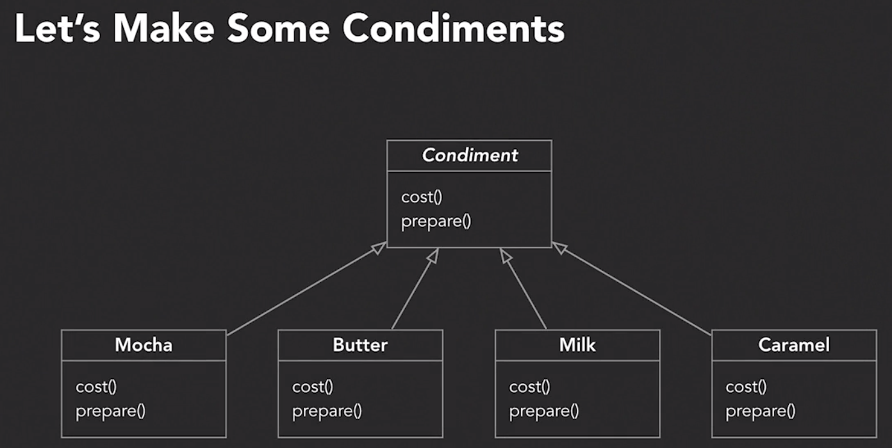

# Advanced Design Patterns: Design Principles

## Design Principles

- Guidelines, not rules, or laws
- Observed to result in good object-oriented designs
- Help us to avoid bad object-oriented design

### Symptons of Bad Design

- Rigidity
- Fragility
- Immobility

### Encapsulate What Varies

- Identify the aspects of your application that vary and separate them from what stays the same
- Look for code that changes with every new requirement
- Alter or extend the code that varies without affecting code that doesn't
- Basis of almost every design pattern

### Favor composition over inheritance

- `HAS-A` is better than `IS-A`
- Instead of inheriting behavior, we can compose our objects with new behaviors
- Composition often gives us more flexibility, even allows behavior changes at runtime

### Loose coupling

- Components should be independent, relying on knowledge of other components as little as possible
- Reduces the dependency between components

### Program to Interfaces

- Program to interfaces, not implementations
- where possible, components should use abstract classes or interfaces instead of a specific implementation
- Program to a `super type`
- We always have to instantiate a concrete type however
- Allows you to better exploit polymorphism
- Frees classes from knowledge of concrete types
- Improves extensibility and maintainability

### Single Responsibility Principle

- Look at change in your class: are parts of it changing while other parts aren't?
- Change only matters if it really happens (if the class isn't changing then, why bother?)

### Open-closed principle

- Our object-oriented designs should be open for extension, but closed for modification
- Allow new behavior without rising changes to proven code
- Improve maintainability and extensibility of a design

### Liskov's subistitution principle

- You should always be able to substitute subtypes for their base class
- Classic Rectangle/Square area problem

### Interface segregation principle

- Cohesion
  - How strong are the relationships between an interface's methods
- Highly cohesive interfaces lead to more maintainable and more flexible systems
- Segregate inerfaces as necessary to keep them focused and cohesive

### Dependency inversion principle

- High-level modules should not depend on low-level modules
- Helps design software that is reusable and resilient to change
- All relationships should invilve abstract classes of interfaces
- Abstractions allow details to remain isolated from each other

